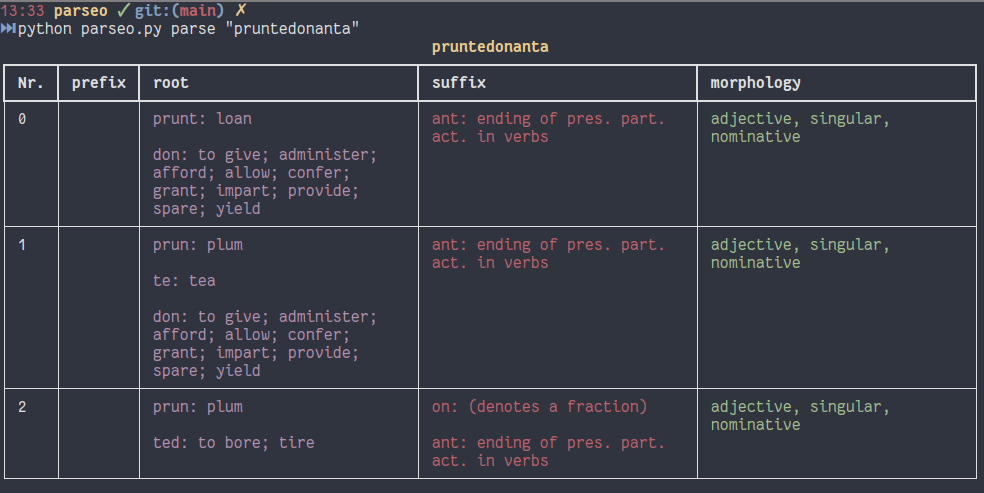

# parseo
A smart esperanto word parser that shows all possible word compositions from roots, affixes and word endings. 
Based on the wordlists of Baza Radikaro Oficiala.

Web version: [http://parseo.online](http://parseo.online)

Usage from command line: 
    
    python parseo.py parse [esperanto-word]
    
For Example:
  
    python parseo.py parse pruntedonanta

outputs:

Parseo also can parse and translate numbers and understands the x-system, so this works too:

    python parseo.py parse "kvin milionoj kvarcent tridek kvin mil sescent okdek naux"

Commands:

- parse: outputs possible interpretations of a single word as a table (as seen above)
- parse_to_json: outputs possible interpretations of a single word as json
- parse_all_min: outputs a whole text with simple color coding of affixes and morpheme borders (see below)

